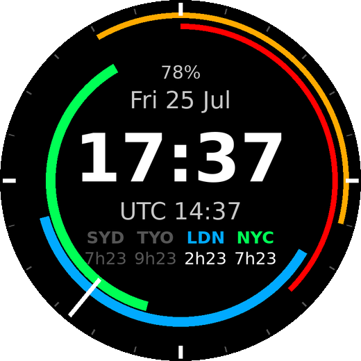
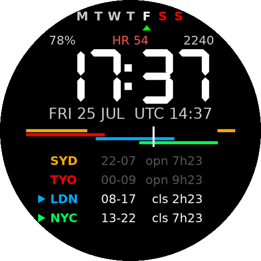

# Trade Sessions — Forex Session Watch Faces for Garmin fēnix 7

Two Garmin Connect IQ watch faces for the **fēnix 7 / 7 Pro family** that show
the major forex trading sessions, inspired by
[TradingView's Trade Time clock](https://www.tradingview.com/tradetime/).
Each face is its own small Connect IQ project — build and install both, then
pick one on the watch under **Settings → Watch Face**.

| `sessions-dial/` — 24h session dial | `sessions-lcd/` — digital / data-rich |
|---|---|
|  |  |

Both faces use the same sessions and colors (defaults, configurable — see
[Session hour settings](#session-hour-settings)):

| Session  | Color | UTC hours     |
|----------|-------|---------------|
| Sydney   | Amber | 22:00 – 07:00 |
| Tokyo    | Red   | 00:00 – 09:00 |
| London   | Blue  | 08:00 – 17:00 |
| New York | Green | 13:00 – 22:00 |

## Face 1: Trade Sessions (dial)

- The bezel is a **24-hour UTC dial**: 00:00 UTC at the top, time runs
  clockwise, ticks every hour, emphasized at 00/06/12/18 UTC.
- One colored arc per session; the **white radial marker** is current UTC
  time — every arc it crosses is a session open right now, and overlaps
  (e.g. London/New York 13:00–17:00 UTC) show as two arcs under the marker.
- Center: battery, date, local time, UTC time, and a **session panel** — one
  column per session with a countdown under each abbreviation: while a
  session is open it is bright and counts down to its close; while closed it
  is dimmed and counts down to its open.

## Face 2: Trade Sessions LCD (digital)

A dense digital layout in the spirit of classic LCD faces:

- **Day-of-week strip** (`M T W T F S S`) with today marked, weekend in red.
- **Battery / heart rate / steps** row.
- Big **local time** in a real **7-segment LCD font** (custom bitmap font,
  generated into `sessions-lcd/resources/fonts/`), respecting the 12/24h
  setting.
- Date and **UTC time**.
- A **linear 24-hour UTC bar** (midnight UTC left edge, one thin colored line
  per session) with a white now-marker — the linear version of the dial.
- A **session table**, one row per session:

  ```
  ▶ LDN   08-17   cls 2h23     <- open: bright, triangle, time to close
    SYD   22-07   opn 7h23     <- closed: dimmed, time to open
  ```

  So at a glance: which sessions are active, their UTC open–close hours, and
  exactly how long until each one opens or closes.

## Session hour settings

Session open/close hours (UTC, whole hours) are configurable on both faces
and default to the table above:

- **On the watch:** in the watch face picker, select the face and open its
  **Customize/Settings** entry. Each menu item shows one boundary
  (e.g. *London open — 08:00 UTC*); pressing it advances the hour by one,
  wrapping at 24. This also works for sideloaded builds.
- **From the phone:** when the face is installed through the Connect IQ
  store, the same settings appear in the Connect IQ mobile app (sideloaded
  `.prg` files don't get phone settings — use the on-watch menu instead).
- **Simulator:** *File → Edit Application Settings*.

This is also the practical way to handle daylight saving: nudge the affected
sessions by an hour when the US/UK/AU clocks change.

## Building

1. Install the [Connect IQ SDK](https://developer.garmin.com/connect-iq/sdk/)
   via the SDK Manager and generate a developer key.
2. **VS Code (recommended):** install the *Monkey C* extension and open the
   face's folder (`sessions-dial/` or `sessions-lcd/`) as the workspace
   folder, then `Monkey C: Build Current Project` (or `Run` for the
   simulator) and pick your device, e.g. `fenix7pro`.
3. **CLI**, from the repo root:

   ```sh
   monkeyc -o bin/TradeSessions.prg    -f sessions-dial/monkey.jungle -y /path/to/developer_key.der -d fenix7pro
   monkeyc -o bin/TradeSessionsLcd.prg -f sessions-lcd/monkey.jungle  -y /path/to/developer_key.der -d fenix7pro
   ```

## Installing on the watch (sideload)

Connect the watch over USB and copy the built `.prg` file(s) into the
`GARMIN/Apps` folder on the device, then eject. Select the face on the watch
under **Settings → Watch Face**.

Supported devices: fēnix 7, 7S, 7X, 7 Pro, 7S Pro, 7X Pro (incl. no-wifi variants).

## Notes & caveats

- **DST:** the default hours are the commonly used fixed-UTC approximations.
  Real session opens shift by an hour with US/UK/AU daylight saving — adjust
  them in the settings when clocks change.
- Colors are easy to tweak: see `_colors` at the top of each face's
  `source/*View.mc`; default hours live in `SessionConfig`
  (`source/SettingsMenu.mc`) and `resources/settings/properties.xml`.
- Heart rate on the LCD face shows `--` until the optical sensor reports a
  reading; steps come from the daily activity monitor.
- Faces redraw once per minute (standard low-power watch face behavior),
  which is battery friendly on the MIP display.
